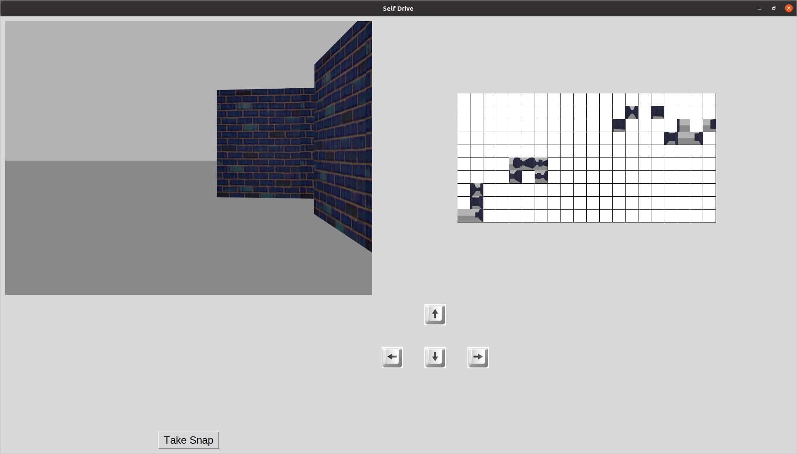

# AI Robotics Platform

# Summary
The AI Robotics platform is a turtleBot based robotics platform designed to host robot orienteering games for experimentation and education purposes. The platform utilizes ROS Gazebo for creating a simulation environment in addition to working in conjunction with mazes built in the real world. The playground introduce 2D topological mapping and Visual Place Recognition (VPR) concepts to players while enhancing accessibility to robotics education by leveraging exisitng low-cost systems.

# Requirements
1. Ubunut 20.04 (Shared Machine will be availble in Games Lab)
2. ROS Noetic

# Setup
## 1. Workspace Preparation
create a seprate catkin_workspace to avoid any conflicts with your current ones

```console
mkdir -p ~/catkin_ws_emb/src
cd ~/catkin_ws/
catkin_make
source devel/setup.bash
```


## 2. Download Repo
1. remove the src created in the previous step
```console
rm -r src
```
2. download this repo and rename as src
```console
git clone https://github.com/ai4ce/Embodied_AI_Platform.git
mv Embodied_AI_Platform/ src/

```
3. catkin_make && source devel/setup.bash


## 3. Run Demo
```console
roslaunch emb_dev dev.launch
```
you should see console output like this 

```console
Published maze: 10 x 20
Publish as occupancy grid ...
```
# GUI

The graphical user interface serves as the portal from which users interact with the platform in both simulated and real world environments.

*Caption: The view of the real world maze from the overhead camera.*

## Controls
The first iteration of the platform was build using a Turtlebot Burger in conjunction wit ha Raspberry pi 4 with a Raspberry pi camera in addition to an Intel RealSense D435 for the overhead camera that provides localization.

*Caption: The view of the real world maze from the overhead camera.*

## Video Feed
## Capture Button
## Mapping
### Simulation
### Real World
In the real world the maze is build atop a 3m x 3m mat with the corners identified by unique codes. By using cardboard, wood panels, and 3D printing techniques it is easy to repeatedly reconfigure the modular maze to reflect the maze generated by the maze generation program. 

*Caption: An iteration of a real world maze.*


*Caption: The view of the real world maze from the overhead camera.*

In the real world maze, unique designs are added to maze walls to aid the user in navigation.

*Caption: The view of the real world maze from the overhead camera.*
