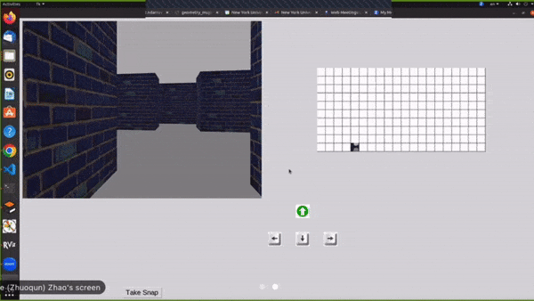
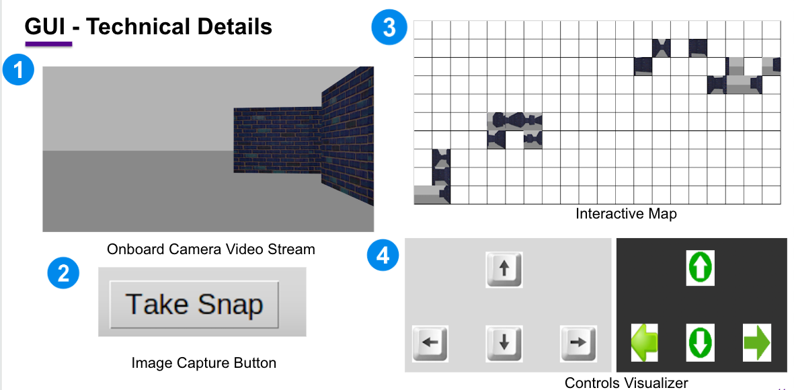
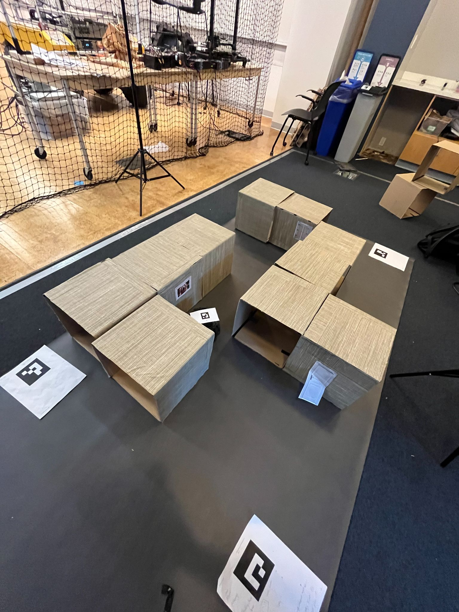
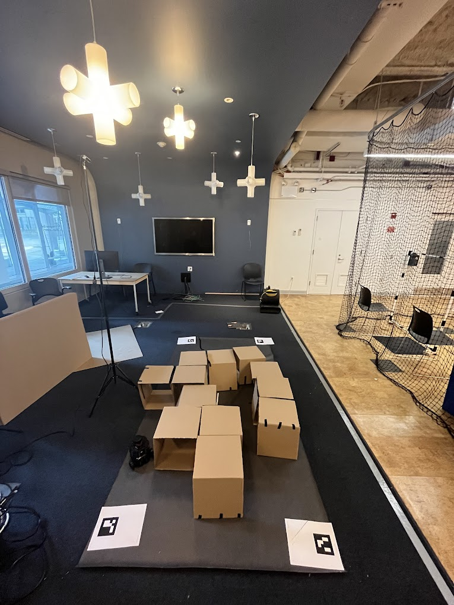
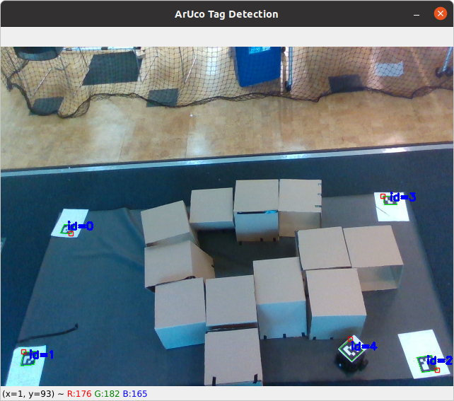
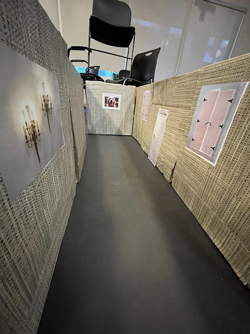

# AI Robotics Platform

# Summary
The AI Robotics platform is a turtleBot based robotics platform designed to host robot orienteering games for experimentation and education purposes. The platform utilizes ROS Gazebo for creating a simulation environment in addition to working in conjunction with mazes built in the real world. The playground introduce 2D topological mapping and Visual Place Recognition (VPR) concepts to players while enhancing accessibility to robotics education by leveraging exisitng low-cost systems.

# Requirements
1. Ubunut 20.04 (Shared Machine will be availble in Games Lab)
2. ROS Noetic

# Setup
## 1. Workspace Preparation
create a seprate catkin_workspace to avoid any conflicts with your current ones

```console
mkdir -p ~/catkin_ws_emb/src
cd ~/catkin_ws/
catkin_make
source devel/setup.bash
```


## 2. Download Repo
1. remove the src created in the previous step
```console
rm -r src
```
2. download this repo and rename as src
```console
git clone https://github.com/ai4ce/Embodied_AI_Platform.git
mv Embodied_AI_Platform/ src/

```
3. catkin_make && source devel/setup.bash


## 3. Run Demo
```console
roslaunch emb_dev dev.launch
```
you should see console output like this 

```console
Published maze: 10 x 20
Publish as occupancy grid ...
```
# GUI

The graphical user interface serves as the portal from which users interact with the platform in both simulated and real world environments.




*GUI Components labelled.*

## 1. Video Feed
The video feed from the onboard raspberry pi camera or simulated onboard camera is collected and fed to a window in the GUI.

## 2. Capture Button
The capture button, labelled "Take Snap" in the GUI, saves the current frame in the video feed display and adds it to the frame with the corresponding location in the map.

## 3. Mapping
The map widget appears in both the realworld and simulation GUI in the same way. Each cell corresponds to the cell in the enviornments and any taken snap is localized to a cell and displayed in the map widget.
### Simulation
In the simulation the location of the turtlebot is known at all times. This location is used to place a taken snap in the corresponding map widget cell.
### Real World
In the real world the maze is build atop a 3m x 3m mat with the corners identified by unique codes. By using cardboard, wood panels, and 3D printing techniques it is easy to repeatedly reconfigure the modular maze to reflect the maze generated by the maze generation program. 


*An iteration of the maze in the real world.*


*Another iteration of a real world maze.*

In the real world the location of the turtle bot is calculated using an overhead camera, a Intel RealSense D435. Once the turtle bot is located, that information is used to pair a snapshot with its corresponding cell in the map widget.


*The view of the real world maze from the overhead camera.*


*Overhead camera providing turtlebot localization.*


<!-- In the real world maze, unique designs are added to maze walls to aid the user in navigation.

*Real world maze walls with unique patterns.* -->


## 4. Controls
The first iteration of the platform is built using a Turtlebot Burger, a Raspberry pi 4 and a Raspberry pi camera. The controls are processed using ROS which is mapped to a user key board. Key entry is visually indicated to the user by the arrow keys in the GUI changing based on whether a key is pressed or not.


